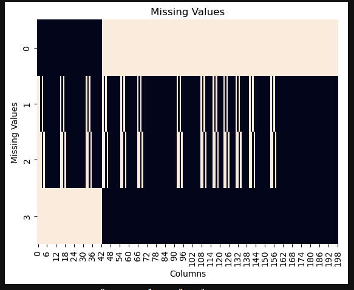
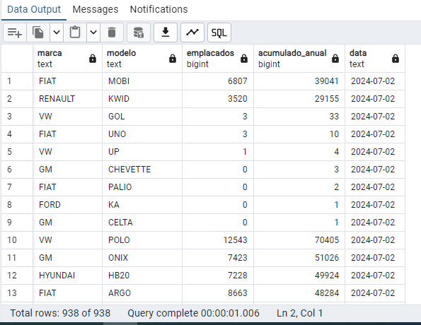

# Extração e Transformação de Dados a partir de PDF
- README em Português, clique aqui -> 

- README in English, click here -> 

## Sobre

Este projeto demonstra como extrair dados de um arquivo PDF contendo dados de carros e salvá-los como um arquivo CSV. Os dados são processados usando bibliotecas Python como `Pypdf`, `pandas`, `numpy`, `seaborn` e `matplotlib`. As principais tarefas realizadas incluem extração, transformação, limpeza e visualização de dados.

## Funcionalidades:

- Baixar um PDF contendo dados do mercado automotivo.
- Extrair as tabelas do PDF.
- Limpar, transformar e organizar os dados em um DataFrame do pandas.
- Visualizar valores ausentes e distribuição de dados.
- Exportar os dados limpos finais para um arquivo CSV para uso posterior.
- Último dataframe carregado em um banco de dados AWS RDS.
- Integração com o MS Power BI para criação de visuais dinâmicos.
- AWS EC2 para rodar um Linux dedicado para o Apache Airflow.
- Apache Airflow para automatização do refresh mensal.

## Exemplo
  
  
  
  

  Dados limpos: Ver data.csv

## Tecnologias Utilizadas e Requisitos

- **Python**: 🐍
- `Pandas`: Biblioteca de manipulação e análise de dados.
- `NumPy`: Biblioteca de computação numérica.
- `Pypdf`: Biblioteca para extração de dados de PDFs.
- `Seaborn`: Biblioteca de visualização de dados baseada no matplotlib.
- `Matplotlib`: Biblioteca de plotagem para criar visualizações.

## Licença

Este projeto está licenciado sob a Licença MIT. Veja o arquivo LICENSE para mais detalhes.

## Contato

Se você tiver alguma dúvida, sinta-se à vontade para entrar em contato vinigoes@outlook.com ou vinox_quente no Discord.
