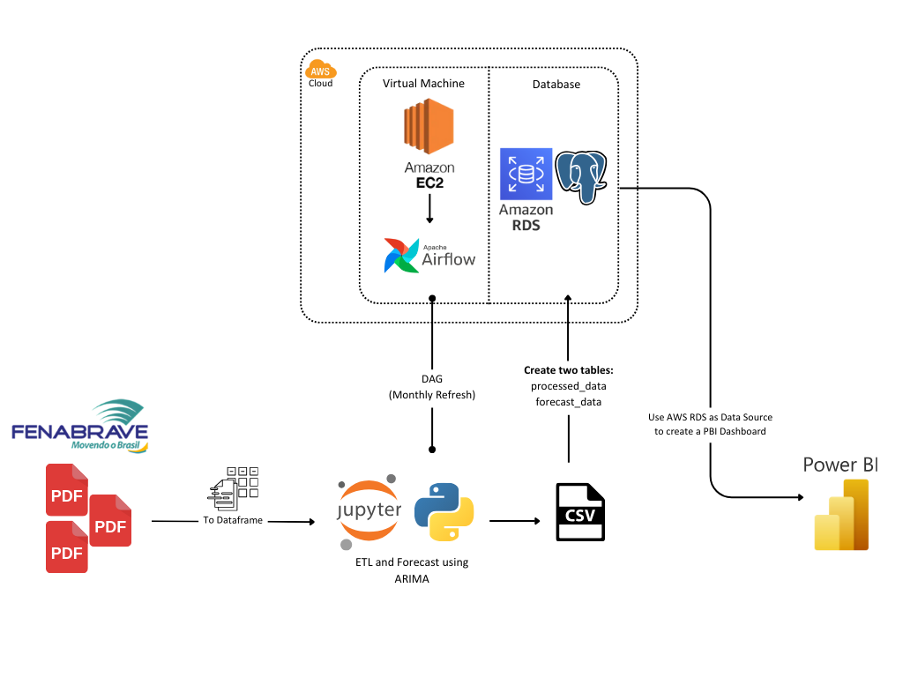
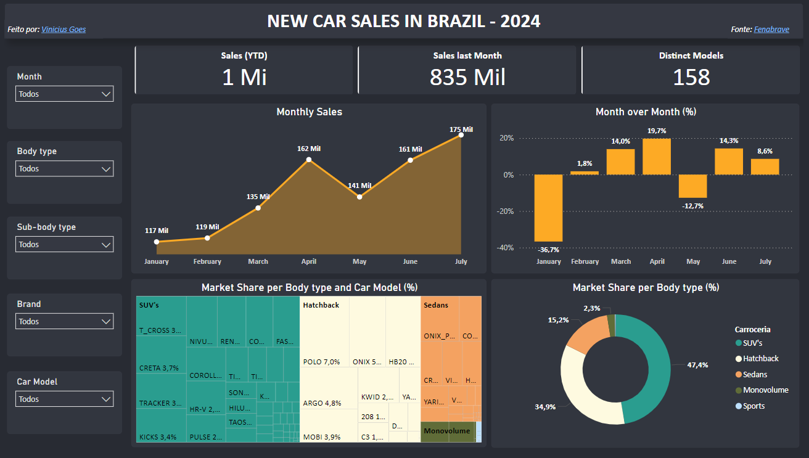
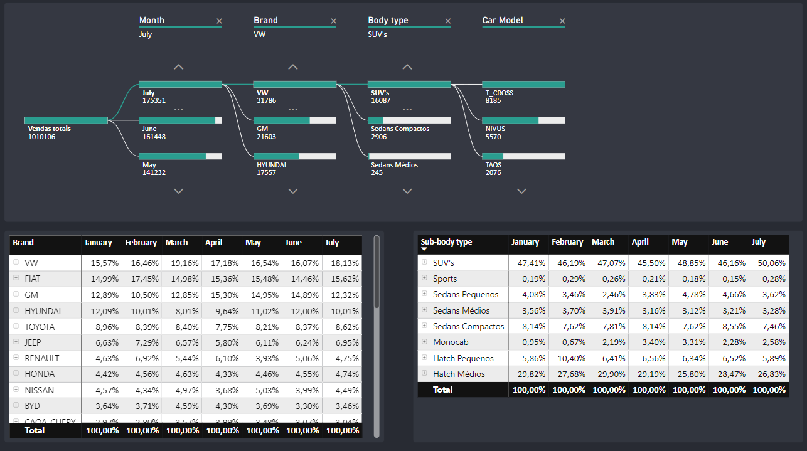

# PDF Data Extraction and Transformation
- README em Português, clique aqui -> 

- README in English, click here -> 

## About

This project extract data from a website (.pdf file) containing car data, manipulate data, store in a AWS RDS, create pipeline with Apache Airflow to automatically refresh and create a Power BI Dashboard. The data is processed using Python libraries such as `pypdf`, `pandas`, `numpy`, `requests`, `seaborn`, and `matplotlib`. The main tasks performed include data extraction, transformation, cleaning, load and visualization.

  

## Features:

- Downloading a PDF containing car market data.
- Extracting the tables from the PDF.
- Cleaning, transforming, and organizing the data into a pandas DataFrame.
- Visualizing missing values and data distribution.
- Exporting the final cleaned data into a CSV file for further use.
- Final DataFrame loaded into **AWS RDS** for storage
- Integrated with **Power BI** for dynamic visualizations
- Configured **Apache Airflow** for automated monthly data refresh

## Images

  
  
  
  
  
  

  Cleaned data: [View data.csv](https://github.com/vin0x/pdf-to-vehicle-data-ETL/blob/main/data/data.csv)

  
## Technologies Used and Requirements

- **Python**: 🐍
- `Pandas`: Data manipulation and analysis library.
- `NumPy`: Numerical computing library.
- `Pypdf`: Library for extracting data from PDFs.
- `Seaborn`: Data visualization library based on matplotlib.
- `Matplotlib`: Plotting library for creating visualizations.
- `Requests`: Send API requests to download file from a website.
- `Scikit-learn`: Train, test, regression and evaluate model performance of past sales data.
- `ARIMA`: Forecasting sales data.

## License

This project is licensed under the MIT License. See the [LICENSE](LICENSE) file for details.

## Contact

If you have any questions, feel free to reach out [vinigoes@outlook.com](mailto:vinigoes@outlook.com) or vinox_quente on Discord.
