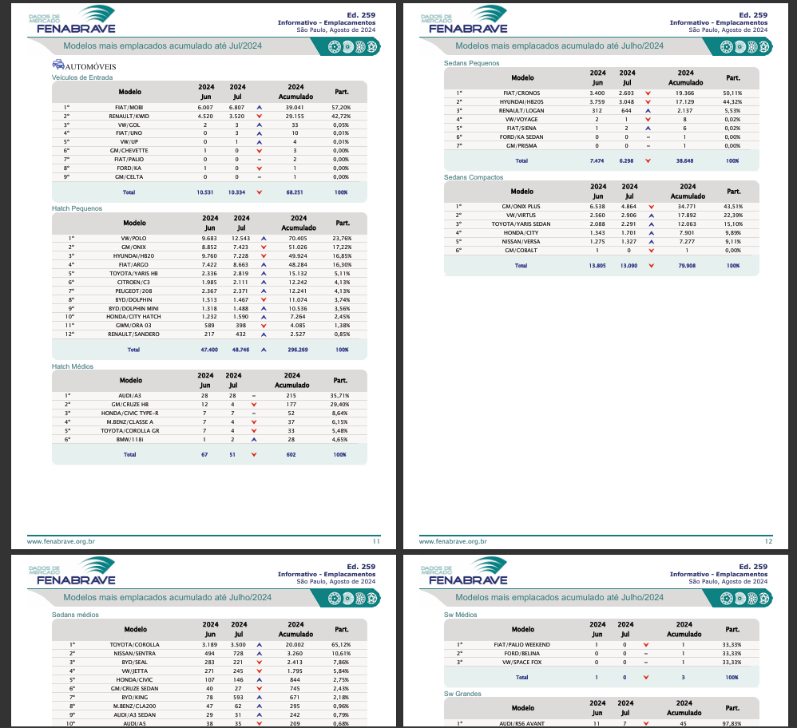
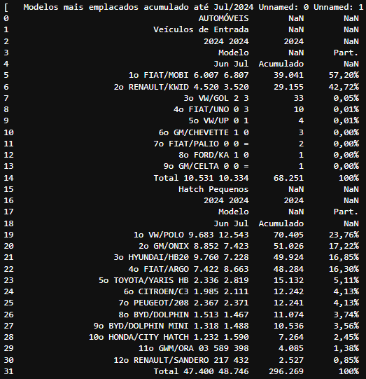
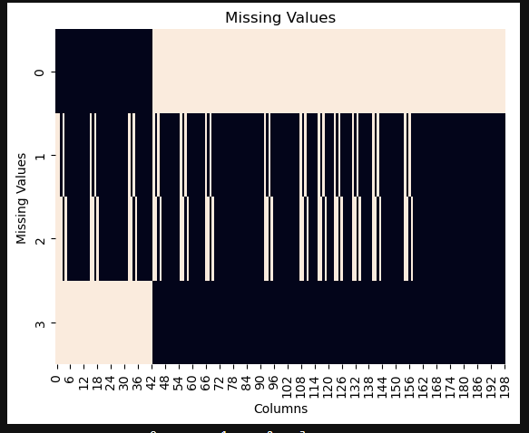

# PDF Data Extraction and Transformation
- README em Português, clique aqui -> [](https://github.com/vin0x/pdf-vehicle-data-ETL/blob/main/README-pt_br.md)

- README in English, click here -> [](https://github.com/vin0x/pdf-vehicle-data-ETL/blob/main/README.md)

## About

This project demonstrates how to extract data from a PDF file containing car data, and save it as a CSV file. The data is processed using Python libraries such as `tabula`, `pandas`, `numpy`, `seaborn`, and `matplotlib`. The main tasks performed include data extraction, transformation, cleaning, and visualization.

_PS: Load part coming soon..._

## Features:

- Downloading a PDF containing car market data.
- Extracting the tables from the PDF.
- Cleaning, transforming, and organizing the data into a pandas DataFrame.
- Visualizing missing values and data distribution.
- Exporting the final cleaned data into a CSV file for further use.

## Example
  
  
  

  Cleaned data: [View data.csv](https://github.com/vin0x/pdf-to-vehicle-data-ETL/blob/main/data.csv)

  
## Technologies Used and Requirements

- **Python**: 🐍
- `Pandas`: Data manipulation and analysis library.
- `NumPy`: Numerical computing library.
- `Tabula`: Library for extracting tables from PDFs.
- `Seaborn`: Data visualization library based on matplotlib.
- `Matplotlib`: Plotting library for creating visualizations.

## Installation

To run this project, you need to have Python installed along with the required libraries. You can install the necessary libraries using `pip`:

1. **Clone the repository**:
   ```bash
   git clone https://github.com/vin0x/pdf-to-vehicle-data-ETL.git

2. Place the PDF file (2024_07_02.pdf) in the directory specified in the filepath variable within the notebook.

3. Run the Jupyter notebook to execute the data extraction and transformation process.

4. The final DataFrame will be saved as data.csv in the specified location.

## License

This project is licensed under the MIT License. See the [LICENSE](LICENSE) file for details.

## Contact

If you have any questions, feel free to reach out [vinigoes@outlook.com](mailto:vinigoes@outlook.com) or vinox_quente on Discord.
